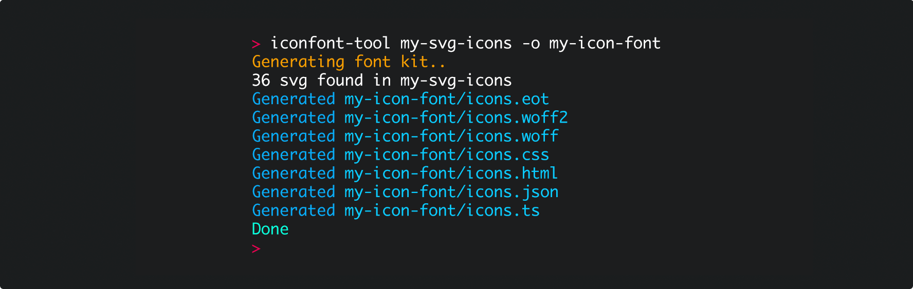

## Fantasticon



> Easy-to-use, pre-configured cli tool to generate web-font icon kits from .svg files

### Intro

Icon-font generation, easy to use and highly configurable.

It also generates TypeScript types, JSON maps of the generated code-points, allowing for a great deal of different usages, e.g. integrating with React type-safe icon components or integration on mobile apps by just combining TTF and JSON generation.

### Install

```
npm install -g fantasticon
```

## Use

### Quick usage

```
fantasticon my-icons -o icon-dist
```

### Command-line

**Note:** Not all options can be specified through the command line - for `formatOptions`, `pathOptions` and `templates` use a [configuration file](#configuration-file) or the javaScript API.

```bash
Usage: fantasticon [options] [input-dir]

Options:
  -V, --version                output the version number
  -c, --config <value>         custom config path (default: .fantasticonrc | fantasticonrc | .fantasticonrc.json | fantasticonrc.json | .fantasticonrc.js | fantasticonrc.js)
  -o, --output <value>         specify output directory
  -n, --name <value>           base name of the font set used both as default asset name and classname prefix (default: icons)
  -t, --font-types <value...>  specify font formats to generate (default: eot, woff2, woff, available: eot, woff2, woff, ttf, svg)
  -g --asset-types <value...>  specify other asset types to generate (default: css, html, json, ts, available: css, scss, sass, html, json, ts)
  -h, --font-height <value>    the output font height (icons will be scaled so the highest has this height) (default: 300)
  --descent <value>            the font descent
  --normalize <number>           normalize icons by scaling them to the height of the highest icon
  -r, --round [bool]           setup the SVG path rounding [10e12]
  --selector <value>           use a CSS selector instead of 'tag + prefix' (default: null)
  --tag <value>                CSS base tag for icons (default: i)
  -u, --fonts-url <value>      public url to the fonts directory (used in the generated CSS)
  --debug                      display errors stack trace (default: false)
  --silent                     run with no logs (default: false)
  --help                       display help for command
```

### Configuration file

Some options (specifically, `formatOptions` and `pathOptions`) cannot be passed to the cli directly.

To have more control and better readability, you can create a simple configuration file.

By default, `fantasticon` will look for one of following files in the working directory:

```
.fantasticonrc | fantasticonrc | .fantasticonrc.json | fantasticonrc.json | .fantasticonrc.js | fantasticonrc.js
```

You can specify a custom --config option with your configuration file path.

Here's an example `.fantasticonrc.js`:

```js
module.exports = {
  inputDir: './icons', // (required)
  outputDir: './dist', // (required)
  fontTypes: ['ttf', 'woff', 'woff2'],
  assetTypes: ['ts', 'css', 'json', 'html'],
  fontsUrl: '/static/fonts',
  formatOptions: {
    // Pass options directly to `svgicons2svgfont`
    svg: { metadata: { foo: 'bar' }, ascent: 0.5 },
    json: {
      // render the JSON human readable with two spaces indent (default is none, so minified)
      indent: 2
    },
    ts: {
      // select what kind of types you want to generate (default `['enum', 'constant', 'literalId', 'literalKey']`)
      types: ['constant', 'literalId'],
      // render the types with `'` instead of `"` (default is `"`)
      singleQuotes: true
    }
  },
  // Use a custom Handlebars template
  templates: { css: './my-custom-tp.css.hbs' },
  pathOptions: {
    ts: './src/types/icon-types.ts',
    json: './misc/icon-codepoints.json'
  }
};
```

### API

#### Simple usage

```js
import { generateFonts } from 'fantasticon';

generateFonts().then(results => console.log('Done', results));
```

#### Options

```js
import { generateFonts } from 'fantasticon';

generateFonts({
  name: 'icons',
  fontTypes: [FontAssetType.EOT, FontAssetType.WOFF2, FontAssetType.WOFF],
  assetTypes: [
    OtherAssetType.CSS,
    OtherAssetType.HTML,
    OtherAssetType.JSON,
    OtherAssetType.TS
  ],
  formatOptions: { json: { indent: 2 } },
  templates: {},
  pathOptions: {},
  codepoints: {},
  fontHeight: 300,
  round: undefined, // --
  descent: undefined, // Will use `svgicons2svgfont` defaults
  normalize: undefined, // --
  selector: null,
  tag: 'i',
  prefix: 'icon',
  fontsUrl: null
}).then(results => console.log(results));
```

### License

Copyright (c) 2020 Tancredi Trugenberger. - Released under the [MIT license](https://github.com/tancredi/fantasticon/blob/master/LICENSE)
